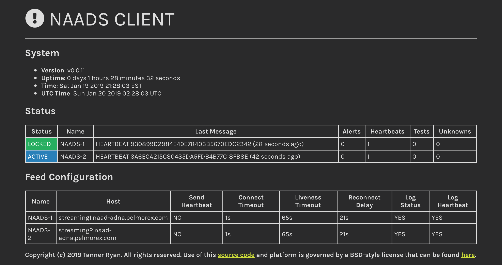

# naads - Highly available Go client for Pelmorex NAADS

Package naads is a highly available client written in Go for Pelmorex's National
Alert Aggregation & Dissemination System (NAADS).

This is a work in progress. **Please do not use it yet as more testing is still
required**. Documentation will be provided soon.

The naads client currently undergoing tests. The test instance is publicly
accessible and can be accessed [here](https://naads.tanner.sh).

## License
Copyright (c) 2019 Tanner Ryan. All rights reserved. Use of this source code is
governed by a BSD-style license that can be found in the LICENSE file.
